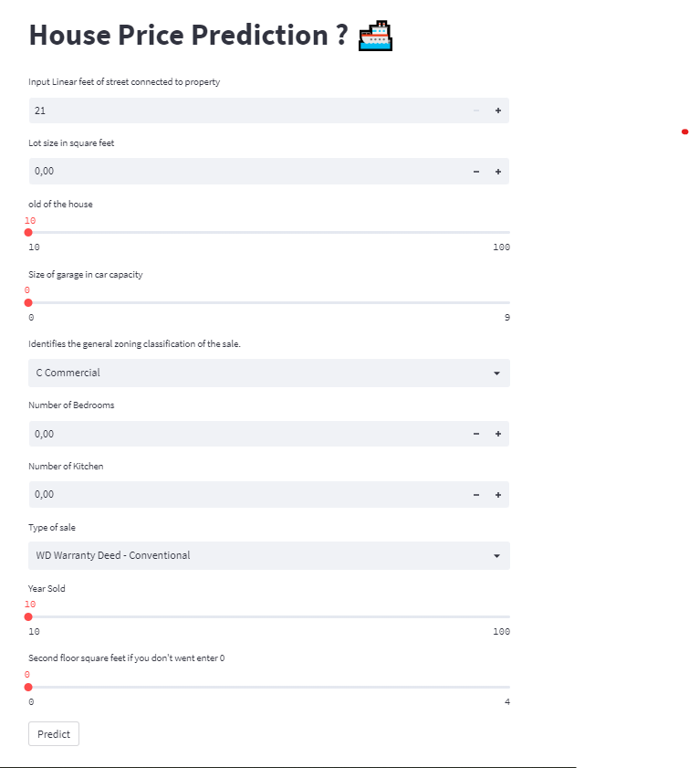

# Docker-portfolio-project

In this project we will create  machine learning model to predict House price , and create its interface using Streamlit. After creating the Streamlit app, we shall use docker to deploy it  .

<p align="center">
  
</p>

##  Prerequisites

To run this project, you will need to install 
[`docker`](https://docs.docker.com/engine/install/ubuntu/)

[`python`](https://www.python.org/downloads/)


## Usage
first go and run House_predict_.ipynb to create model.joblib 
 ```bash
  docker build -t streamlitapp:latest .
```

 ```bash
  docker run  -d -p 8501:8501 streamlitapp:latest
```
## Access to APP
#### 

 - [localhost:8501](http://localhost:8501/)
<p align="center">
  
</p>
## Built With

- Docker
- Streamlit
- scikit-learn


## Authors
Bendra Abdelali
- [Profile](https://github.com/bendraabdelali)
- [Linkedin](https://www.linkedin.com/in/abdelali-bendra-934755182/)
- [Kaggle](https://www.kaggle.com/bendraabdelali)
